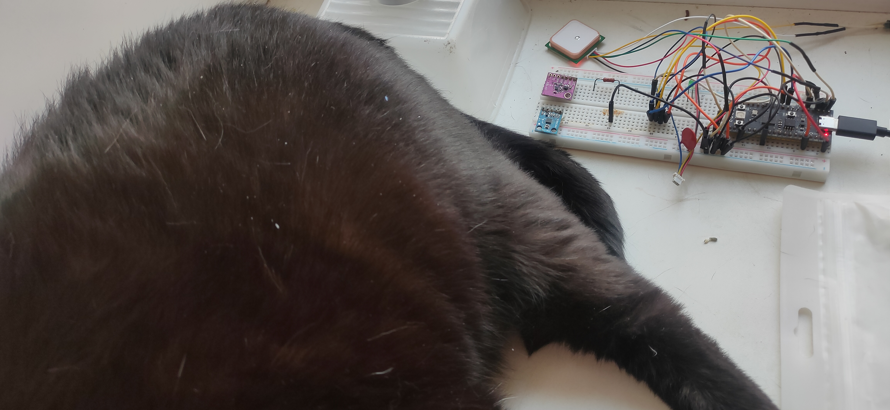
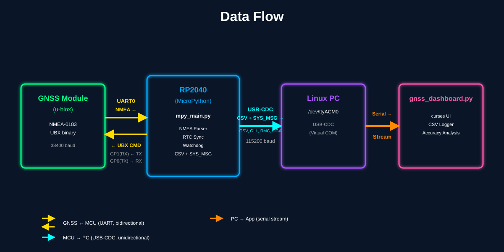
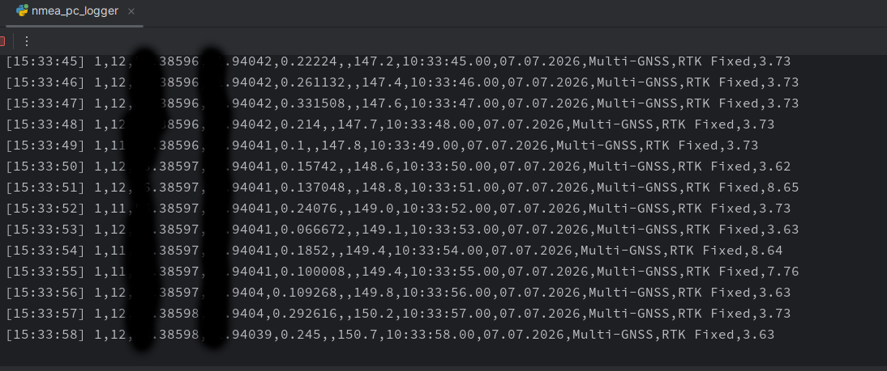
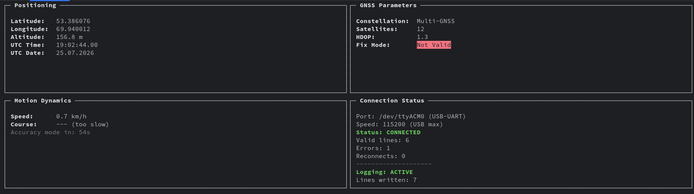
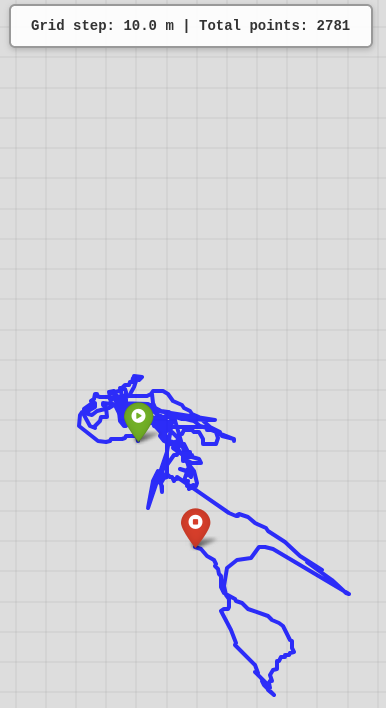

# LightNMEA

[По-русски](https://github.com/octaprog7/light-nmea-micropython/blob/master/README_RU.md)


Extremely fast, zero-dependency, single-pass NMEA 0183 parser with minimal memory allocation, written specifically for MicroPython and Python (CPython).
Designed for 32-bit microcontrollers (ESP32, STM32, RP2040) working with high-rate GNSS receivers (10-50 Hz multi-constellation GPS/GLONASS/BeiDou/Galileo modules).
Why light_nmea?
At the time of creation (2026), there was only one NMEA parser available for MicroPython -- micropyGPS (2018). It works, but is slow (25 packets/sec) and does not support modern GNSS constellations.
light_nmea was built as an alternative:

* 15x(!) faster than micropyGPS
* Support for seven constellations (GPS, GLONASS, Galileo, BeiDou, QZSS, NavIC, Multi-GNSS)
* Zero memory allocation in the parsing loop
* MCU RTC integration (MicroPython)
* Non-blocking UART stream reading

Other popular parsers (pynmea2, pynmeagps) do not work on MicroPython due to dependencies on CPython-specific modules (dataclasses, typing).

## Benchmark

### Benchmark Methodology

To ensure a fair and comprehensive comparison, the benchmark script implements the following conditions:
* **Real-World Payload**: Tests are executed using a representative stream of 300,000 to 1,000,000 NMEA 0183 packets (including standard `RMC` and `GGA` sentences).
* **Warm-up Phase**: Every parser undergoes a warm-up phase (2 complete runs) before the actual measurement to eliminate interpreter initialization overhead.
* **Property Access Validation**: The benchmark does not just call the parser function; it executes a strict property access simulation (`_ = gps.valid` and `_ = gps.latitude`) to force the code to perform complete data decoding and validation.
* **Best of 3**: The final results are based on the minimum elapsed time across 3 independent runs, preventing operating system background task spikes from affecting the data.
* **Garbage Collection**: Explicit `gc.collect()` is invoked before each run to ensure precise memory state baseline.


### Benchmark Results (300,000 Packets)


| Platform / Environment            |  `light_nmea`   | Competitor                 |       Advantage       |
|:----------------------------------|:---------------:|:---------------------------|:---------------------:|
| **CPython** (Ryzen 7 2700)        | **122,861 pps** | `pynmea2`: 81,976 pps      |    **1.5× faster**    |
| **CPython** (Ryzen 7 2700)        | **124,991 pps** | `pynmeagps`: 48,845 pps    |    **2.6× faster**    |
| **CPython** (Ryzen 7 2700)        | **125,000 pps** | `adafruit_gps`: 76,277 pps |    **1.6× faster**    |
| **CPython** (Ryzen 7 2700)        | **127,143 pps** | `micropyGPS`: 35,322 pps   |    **3.6× faster**    |
| **CPython** (Ryzen 7 2700)        | **115,875 pps** | `nmea_parser`: 59157 pps   |    **2.0× faster**    |
| **MicroPython** (RP2040 @ 133MHz) |   **375 pps**   | `micropyGPS`: 25 pps       | **12.0-15.0× faster** |


> **Note:** `pynmea2`, `pynmeagps`, and `adafruit_gps` do not work on MicroPython due to
> dependencies on CPython modules (`dataclasses`, extended `typing`, `circuitpython_typing`).
> `micropyGPS` is the only alternative NMEA parser for MicroPython, but it has not been updated
> since 2018 and is significantly slower. On CPython, the gap is smaller (×3.6), but on
> RP2040 microcontrollers, it reaches ×15 due to the overhead of object creation.

## Zero RAM Allocation on the Hot Path
The main parsing loop (parse_line) does not create new objects in memory:

* Comma positions are stored in a pre-allocated bytearray.
* Message type comparisons (RMC, GGA) and statuses (A, S, W) are performed via integer ASCII codes, not bytes slicing.
* CRC checking is built into the single-pass scanner without separate calls.
* GNSS constellation determination uses a table lookup by ASCII codes.

Allocations only happen to save final values (latitude, longitude, speed, course, altitude, time, date) -- this is inevitable, as the user must receive them as independent objects. However, the parsing process itself does not pollute the heap, which is critical for MicroPython with its small RAM and expensive garbage collector.
## Speed Margin for GPS Applications

| GPS Rate          | Packets/sec | Margin on MicroPython |
|-------------------|-------------|-----------------------|
| 1 Гц (standard)   | 1           | ×375                  |
| 5 Гц (fast)       | 5           | ×75                   |
| 10 Гц (high rate) | 10          | ×37                   |
| 20 Гц (extreme)   | 20          | ×18                   |

Even at a rate of 20 Hz, the microcontroller has an x18 CPU margin for other application logic (display rendering, communication, logging).

## Key Architectural Optimizations

1. Single-pass scanner. In a single pass over the string bytes, it calculates the checksum (XOR), finds the payload boundaries (*), and records the indices of all comma separators (,) into a pre-allocated bytearray.
2. Inline data parsing. The field extraction logic is fully unrolled inside the main loop. All field boundaries are calculated on the fly using the ready indices, which eliminates the overhead of creating stack frames and unnecessary function calls.
3. Protection against GC freezes. Extracting and converting coordinates, speed, and course into numbers happens "on the fly" without generating intermediate string garbage in the heap.

## Supported Messages
### NMEA 0183 v3.x (Standard)

| Message             | Description                                | Support                  |
|---------------------|--------------------------------------------|--------------------------|
| `$GPRMC` / `$GNRMC` | Recommended Minimum Navigation Information | Full parsing             |
| `$GPGGA` / `$GNGGA` | Global Positioning System Fix Data         | Full parsing             |
| `$GPVTG` / `$GNVTG` | Track Made Good and Ground Speed           | Full parsing             |
| `$GPGLL` / `$GNGLL` | Geographic Position                        | Full parsing             |

## NMEA 0183 v4.10+ (новые Talker ID)

| Talker ID | Constellation          | Example  | Support |
|-----------|------------------------|----------|---------|
| `GP`      | GPS (USA)              | `$GPRMC` | +       |
| `GL`      | GLONASS (Russia)       | `$GLRMC` | +       |
| `GA`      | Galileo (EU)           | `$GARMC` | +       |
| `GB`      | BeiDou (China, legacy) | `$GBRMC` | +       |
| `BD`      | BeiDou (China, new)    | `$BDRMC` | +       |
| `QZ`      | QZSS (Japan)           | `$QZRMC` | +       |
| `IR`      | NavIC (Bharat -India)  | `$IRRMC` | +       |
| `GN`      | Multi-GNSS (mixed)     | `$GNRMC` | +       |

### Constellation Filtering
```python
from light_nmea import LightNMEA, CST_MASK_GPS, CST_MASK_GALILEO, CST_MASK_ALL

parser = LightNMEA()

# Accept only GPS and Galileo
parser.set_cst_filter(CST_MASK_GPS | CST_MASK_GALILEO)

# Accept all constellations (default)
parser.set_cst_filter(CST_MASK_ALL)
```

## Installation
### Installing Competitors for Benchmarks
CPython (PC, virtual environment recommended)
```console
python -m venv .venv
source .venv/bin/activate  # Linux/Mac
# .venv\Scripts\activate   # Windows
```
#### Install all competitors with a single command:
```console
pip install pynmea2 pynmeagps
```
#### micropyGPS is not on PyPI -- install from GitHub

```console
pip install git+https://github.com/Knio/micropyGPS.git
```
#### Alternative (if git is not installed):
```console
wget https://raw.githubusercontent.com/Knio/micropyGPS/master/micropyGPS.py
```
### MicroPython
Simply copy the light_nmea folder with the files nmea0183_parser.py, nmea0183_stats.py, nmea0183_stream.py to the root of your microcontroller's filesystem.
There are no dependencies - the library uses only standard modules (gc, time, sys).

## Quick Start
### Basic Usage (Single Packet)
```python
from light_nmea import LightNMEA

# Initialize the parser
parser = LightNMEA(trust_gga_fix=True)

# Raw byte string from UART or log file
raw_sentence = b"$GNRMC,091530,A,5575.2057,N,03762.6130,E,15.0,120.5,220626,,,A*7F"

# Parse the string
if parser.parse_line(raw_sentence):
    if parser.valid:
        print("Latitude: ", parser.latitude)
        print("Longitude:", parser.longitude)
        print("Speed:    ", parser.speed, "km/h")
        print("Time:     ", parser.time.decode('ascii'))
```

### Packet Stream Usage
```python
from light_nmea import LightNMEA

parser = LightNMEA(trust_gga_fix=True)

# Simulate a data stream from a log or UART
stream_packets = (
    b"$GNRMC,091530,A,5575.2057,N,03762.6130,E,15.0,120.5,220626,,,A*7F",
    b"$GNGGA,091530,5575.2057,N,03762.6130,E,1,12,1.0,156.3,M,0.0,M,,*42"
)

for raw_sentence in stream_packets:
    if parser.parse_line(raw_sentence):
        print("--- Packet processed successfully ---")
        print("Fix status: ", parser.valid)
        print("UTC Time:   ", parser.time.decode('ascii') if parser.time else "None")
        
        if parser.has_coordinates():
            print("Coordinates:", parser.latitude, ",", parser.longitude)
            
        if parser.has_navigation():
            print("2D Nav:     ", parser.speed, "km/h,", parser.course, "deg.")
            
        if parser.has_3d_fix():
            print("3D Fix:     ", parser.altitude, "meters")
            
        print("Satellites: ", parser.satellites)
```

### MicroPython Example (RP2040 + UART)
```python
import gc
import time
from machine import UART, Pin, RTC
from light_nmea import LightNMEA

# Configure UART
uart = UART(1, baudrate=9600, rx=Pin(5), rxbuf=512)
parser = LightNMEA(trust_gga_fix=True)
rtc = RTC()

# Critical for stable MCU operation:
gc.threshold(8192)  # Auto GC when memory is low

gc_counter = 0
rtc_synced = False

while True:
    if uart.any():
        raw_line = uart.readline()
        if raw_line and len(raw_line) > 10:
            if parser.parse_line(raw_line):
                if parser.has_coordinates() and not rtc_synced:
                    # Sync RTC on first fix
                    t = parser.time.decode()
                    d = parser.date.decode()
                    rtc.datetime((
                        # Date format is DDMMYY, hence + 2000!
                        2000 + int(d[4:6]), int(d[2:4]), int(d[0:2]), 0,
                        int(t[0:2]), int(t[2:4]), int(t[4:6]), 0
                    ))
                    rtc_synced = True
                
                # Periodic GC every 500 packets
                gc_counter += 1
                if gc_counter >= 500:
                    gc.collect()
                    gc_counter = 0
    
    time.sleep_ms(10)
```

## API Reference
### Properties
* parser.valid (bool): Fix validity flag (True = fix acquired, False = no fix).
* parser.latitude (float | None): Latitude in degrees (WGS84, range -90.0 to +90.0).
* parser.longitude (float | None): Longitude in degrees (WGS84, range -180.0 to +180.0).
* parser.speed (float | None): Movement speed. Automatically converted to km/h.
* parser.course (float | None): True course (track angle) in degrees relative to geographic north (0.0 - 359.9).
* parser.altitude (float | None): Altitude above mean sea level (geoid) in meters.
* parser.satellites (int): Number of satellites used in the solution.
* parser.time (bytes): UTC time bytes (format HHMMSS).
* parser.date (bytes): UTC date bytes (format DDMMYY).

### State Check Methods
* parser.has_coordinates() -> bool: True if both latitude and longitude are parsed and not None.
* parser.has_navigation() -> bool: True if valid coordinates are available, along with speed and course parameters (full 2D fix).
* parser.has_3d_fix() -> bool: True if altitude above sea level is available in addition to 2D coordinates (full 3D fix from GGA).

### Memory Monitoring (GPSStats Class)
To monitor memory usage, the stats.get_memory_usage() -> float method is used, which returns the amount of occupied kilobytes.

* Under MicroPython, it automatically calls gc.collect() to get the actual heap size.
* Under Windows and Linux, it queries operating system interfaces without using external libraries.

## Anti-Spam Filter

GNSS receivers can send duplicate packets at high frequencies (5-10 Hz or more). 
The `NMEAStreamReader` includes a built-in rate limiter that filters redundant 
GGA/RMC packets before they reach the parser, reducing CPU load on microcontrollers.

This feature is particularly useful when working with high-rate GNSS modules that 
send the same data multiple times per second, allowing you to process only unique 
updates while maintaining navigation accuracy.

### How it works

The filter operates at the stream reader level, **before** packets reach the parser:

1. **Independent tracking** — GGA and RMC packets are tracked separately. A filtered GGA does not affect RMC reception, and vice versa.

2. **Time-based filtering** — each packet type has its own timestamp. If a new packet of the same type arrives within the configured interval, it is silently dropped.

3. **Unknown messages bypass** — packets of types other than GGA/RMC (GSV, GSA, VTG, etc.) are always passed to the parser unchanged. The filter does not interfere with them.

4. **Zero-allocation** — the implementation uses `time.ticks_ms()` on MicroPython and `time.monotonic()` on CPython. No strings, lists, or heap allocations are created during filtering.

Example timeline with a 100ms interval:

| Time   | Packet | Action                      |
|--------|--------|-----------------------------|
| 0 ms   | GGA    | Accepted                    |
| 3 ms   | RMC    | Accepted (different type)   |
| 50 ms  | GGA    | Dropped (only 50ms elapsed) |
| 100 ms | GGA    | Accepted (100ms elapsed)    |
| 103 ms | RMC    | Accepted (different type)   |

### Usage

```python
from light_nmea import LightNMEA, NMEAStreamReader

reader = NMEAStreamReader(uart)
parser = LightNMEA()

# Enable anti-spam filter: minimum 100ms between packets of the same type
reader.set_anti_spam_interval(100)

while True:
    packets = reader.read_available(parser)
    if packets > 0 and parser.valid:
        print(f"Lat: {parser.latitude}, Lon: {parser.longitude}")
```
* To disable the filter, pass 0 or None:
```python
reader.set_anti_spam_interval(0)  # All packets will be passed to the parser
```

### Configuration

The filter interval is set via `set_anti_spam_interval(interval_ms)`.

| Interval      | Behavior                                                                |
|---------------|-------------------------------------------------------------------------|
| `0` or `None` | Filter disabled -- all packets passed to parser                         |
| `100`         | Default for high-rate receivers -- drops duplicates within 100ms window |
| `500`         | Moderate filtering -- good for 2-5 Hz receivers                         |
| `1000`        | Aggressive filtering -- one packet per second per type                  |

Valid range: `0` to `1000` milliseconds. Values outside this range raise `ValueError`.

**How to choose the right interval:**

- For **1 Hz receivers** (standard GPS modules): use `0` (disabled) -- filtering is not needed
- For **5-10 Hz receivers** (high-rate modules): use `100-200` -- keeps one update per 100-200ms
- For **power-saving applications**: use `500-1000` -- reduces CPU wake-ups significantly

### When to use

- High-frequency GNSS receivers (5-10 Hz or more) sending duplicate GGA/RMC packets.
- Reducing CPU load and saving power on microcontrollers.
- Preventing parser spam when your application logic only needs 1 Hz updates.

### When NOT to use

- Standard 1 Hz receivers (filtering is unnecessary and adds slight overhead).
- Post-processing NMEA log files (use the parser directly, bypassing the stream reader).
- Applications requiring every single raw packet for precise timing, RTK base stations, or raw data logging.

### Diagnostics and Reset

The stream reader keeps an internal counter of packets dropped by the anti-spam filter. This is useful for debugging and tuning the interval for your specific hardware.

```python
print(f"Dropped by filter: {reader.anti_spam_dropped}")
```
If the GNSS module loses power, or if you change the UART baud rate at runtime, you should reset the stream reader state. This clears the internal buffer cursor, all statistical counters, and the anti-spam timestamps, ensuring the first packet after reconnection is always accepted.

```python
reader.reset()
```

## Project Directory Structure
When transferring the library to a microcontroller, only the light_nmea folder is required. The other scripts are used for testing and benchmarking on a PC.

```console
light-nmea-mp/
|-- LICENSE                  # GNU GPL v3.0 License
|-- README_RU.md             # Project documentation (Russian)
|-- README.md                # Project documentation (English)
|-- analyze_accuracy.py      # Calculation of accuracy parameters based on the data in the gnss_log.txt file, which is created by the nmea_pc_logger.py script
|-- nmea_pc_logger.py        # GNSS Data Logger - Record navigation data from a microcontroller to a CSV file
|-- gnss_dashboard.py        # Version with extended functionality of nmea_pc_logger
|-- visualize_gps.py         # GNSS Track Visualization Script (dependencies: pandas, folium)
|
|-- light_nmea/              # Isolated parser package (copy to MCU)
|   |-- __init__.py          # Python package marker
|   |-- nmea0183_parser.py   # Parser core
|   |-- nmea0183_stats.py    # Statistics and RAM measurement module
|   +-- nmea0183_stream.py   # UART reader with ring buffer
|
|-- Entry points
|   |-- main.py              # Stress test for 1,000,000 packets (CPython)
|   +-- mpy_main.py          # Main script for RP2040
|
|-- Tests
|   |-- test_leak.py         # Memory leak check script
|   |-- uart_test.py         # UART test with a real GPS module
|   +-- run_tests.sh         # Automatic bash script for running tests
|
|-- Benchmarks (comparison with competitors)
|   |-- benchmark/           # Benchmark folder
|   |   |-- benchmark_pynmea2.py     # Comparison with pynmea2 (CPython)
|   |   |-- benchmark_pynmeagps.py   # Comparison with pynmeagps (CPython)
|   |   |-- benchmark_micropygps.py  # Comparison with micropyGPS (MicroPython/CPython)
|   |   |-- benchmark_adafruitgps.py # Comparison with adafruit_gps (CPython)
|   |   |-- bench_utils.py   
|   |   |-- busio.py         # Mock module for CPython
|   |   |-- micropython.py   # Mock module for CPython
|   |   +-- readme.txt       # Benchmark description
|   +-- nav_gen.py           # Test NMEA packet generator
|
+-- Test dependencies
    +-- micropyGPS.py        # Local copy of micropyGPS for testing
    +-- adafruit_gps.py      # Local copy of adafruit_gps for testing
```

## NMEAStream Module (nmea0183_stream.py)
The nmea0183_stream module implements non-blocking UART reading with a ring buffer and automatic extraction of complete NMEA packets. It solves the main problem when working with GPS modules on microcontrollers: packet loss due to UART buffer overflow.
### Purpose

* Reading bytes from UART without blocking the main application loop
* Accumulating data in a fixed-size ring buffer
* Extracting complete packets (from $ to \r\n) with built-in CRC validation
* Passing ready packets to the LightNMEA parser
* Cooperative operation with time.sleep_ms() and gc.collect()

## NMEAStream Class (UART Streaming)
NMEAStream(uart, buffer_size=512): Constructor. Accepts a machine.UART object and the ring buffer size in bytes (default is 512).
### Methods

* read_available() -> int: Reads all available bytes from the hardware UART buffer into the ring buffer. Does not block execution. Returns the number of bytes read.
* get_packet() -> bytes | None: Extracts the next complete and valid NMEA packet (with CRC check) from the buffer. Returns bytes or None if the packet is incomplete or corrupted.
* buffer_usage() -> int: Returns the current number of bytes occupied in the ring buffer (from 0 to buffer_size). Useful for overflow monitoring.
* reset() -> None: Force clears the ring buffer and resets the frame search state. Used in case of critical overflow.

## Tools for working with light_nmea

### nmea_pc_logger.py

Script for recording GNSS data from a microcontroller to a PC.

#### Installing Dependencies

```bash
pip install pyserial
```

### Hardware Setup


*Testing light_nmea on real hardware (under strict feline QA supervision).*

### PC Logger Output

#### Data Flow




### Dashboard


### GNSS Track Visualization (HTML Map)

Use `visualize_gnss.py` to generate interactive HTML maps from recorded GNSS logs. The script reads `gnss_log.csv` and creates a standalone HTML file with an interactive map showing the complete track.

#### Usage:

```bash
# Generate HTML map from CSV log
#  input: gnss_log.csv
#  output: gnss_track.html
python3 visualize_gnss.py
``` 


---

## Acknowledgments & Dedication

This project is dedicated to the exceptional engineering education provided by the **Faculty of Radio Engineering (RTF)** at **USTU-UPI** (Ural State Technical University — UPI, currently known as **UrFU** — Ural Federal University), during the academic years **1993–1998**.

Special thanks and highest professional respect to the faculty members of the **Radio Receiving Devices (RPU)** and **Radio Transmitting Devices (RPrU)** departments in Ekaterinburg, as well as the entire engineering teaching staff of the **Kamensk-Uralsky branch**. The knowledge you shared with me laid the foundation for everything I do!

In honorable memory and deepest respect to the core mentors:
* **V. A. Dobryak** (RPrU department)
* **N. A. Dyadkov** (RPU department)
* **V. V. Kiyko** (Automation department)
* **B. A. Panchenko** (RPrU department)
* **S. N. Shabunin** (RPrU department)
* *...and many other faculty members.*

*Thank you!*


## Authorship and License
Copyright 2026 Roman Shevchik
### License
GNU General Public License v3.0 (GPL-3.0).
Free use, modification, and distribution of the code are permitted provided that the source code remains open (copyleft). The license protects users from patent trolls, prohibits the use of the code in closed hardware, and requires preserving notices of original authorship in all modified versions of the files. Any derivative product using this code must be distributed under the same GPL-3.0 license.